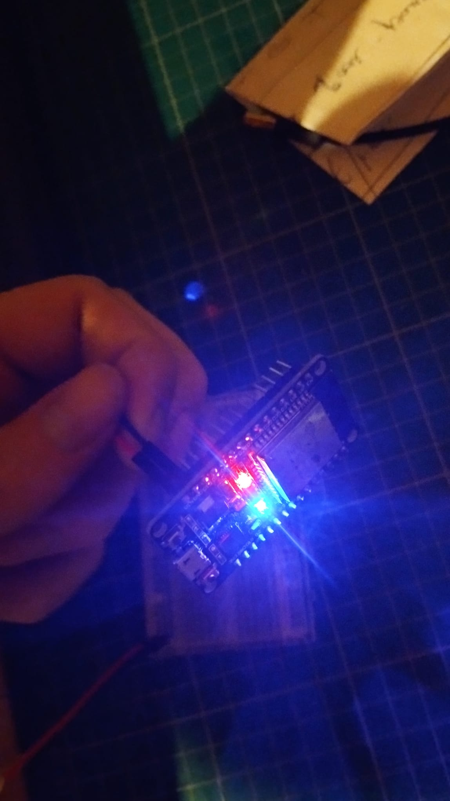

# BOOM
boom project with wannes. sensor implementatie
## includes
1: test blinkercode for 32 wroom with, but power supply is not going tgrough microusb, but through the board.  this is so we can connect the board safely to ther terminal block

2: screw terminal breakoput board for esp32. kiCad diagram and schamatics.
    download symbol from snapeda: https://www.snapeda.com/parts/ESP32-DEVKIT-V1/Do%20it/view-part/?t=esp32%20devkitv1

## inspiration:
install esp32 block  on bin rail
https://www.youtube.com/watch?v=UIU_M9MApd0

kiCad pcb layout: https://www.youtube.com/watch?v=3FGNw28xBr0

make an esp32 breakout block with terminal screws: https://www.youtube.com/watch?v=nSP0rKtDYko
