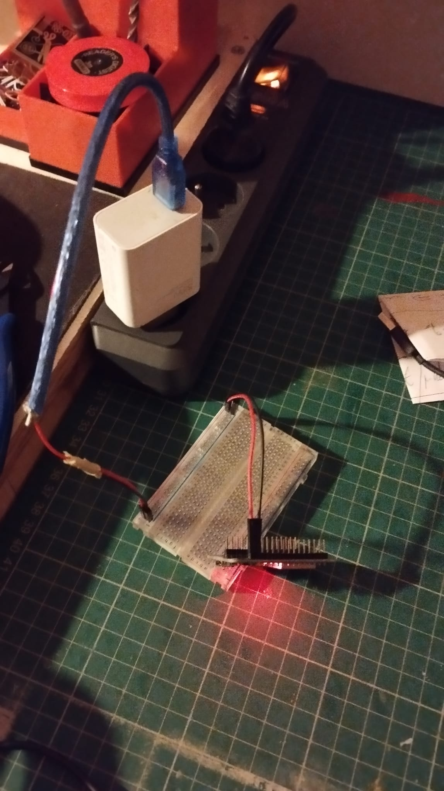

# BOOM
boom project with wannes. sensor implementatie
## includes
1: test blinkercode for 32 wroom with, but power supply is not going tgrough microusb, but through the board.  this is so we can connect the board safely to ther terminal block. in the following example i connect the VCC and GND from a 5v convertedr inbto the VIN pin and ibn tot GND pin of the nmicrocontroller though a breadboard.



2: screw terminal breakoput board for esp32. kiCad diagram and schamatics.
    download symbol from snapeda: https://www.snapeda.com/parts/ESP32-DEVKIT-V1/Do%20it/view-part/?t=esp32%20devkitv1


# Board Schematics
[View Schematics PDF](./media/fuse_box_schematic.pdf)


# design:
design iterations are documented here


# Communication
[View PDF](./media/wannes_rens.pdf)


## inspiration:
install esp32 block  on bin rail
https://www.youtube.com/watch?v=UIU_M9MApd0

kiCad pcb layout: https://www.youtube.com/watch?v=3FGNw28xBr0

make an esp32 breakout block with terminal screws: https://www.youtube.com/watch?v=nSP0rKtDYko


### readme testing

```stl
PGEOMETRY V5
NPoints 340 NPrims 170
NPointGroups 0 NPrimGroups 0
NPointAttrib 1 NVertexAttrib 0 NPrimAttrib 0 NAttrib 0
PointAttrib
uv 3 float 0 0 0
-0.110501543 0.0749448687 0.084066689 1 (0.562288225 0.820269287 0)
-0.113929108 1.07344306 0.138744861 1 (0.562288225 0.820269287 0)
-0.0792489946 0.0912462696 0.0530149788 1 (0.533397675 0.838549256 0)
-0.670758843 0.632817268 -0.544326544 1 (0.533397675 0.838549256 0)
0.138947278 -0.0982342809 -0.025409475 1 (0.423927456 0.607419014 0)
0.370837897 0.62895757 0.620670021 1 (0.423927456 0.607419014 0)
-0.11447791 0.0962311327 0.0168424044 1 (0.552647352 0.885632753 0)
0.149538904 0.614995718 -0.796286345 1 (0.552647352 0.885632753 0)
0.124209456 -0.0658406466 -0.0676927492 1 (0.440565437 0.57268846 0)
0.363203406 0.439964414 0.761187851 1 (0.440565437 0.57268846 0)
0.0867616087 -0.0721778274 -0.0464229211 1 (0.929183722 1.20000553 0)
-0.647127151 -0.302421868 0.592635036 1 (0.929183722 1.20000553 0)
-0.118822426 0.0718342289 -0.029516099 1 (0.122009911 0.480020225 0)
-0.362984687 0.155364424 -0.995646238 1 (0.122009911 0.480020225 0)
-0.0445121415 0.0935890302 -0.00330161513 1 (0.132918417 0.188800812 0)
0.369596869 0.888582408 -0.446583956 1 (0.132918417 0.188800812 0)
0.0494690575 0.0353930928 0.0806257203 1 (0.271412522 0.224321514 0)
0.0557324216 0.578066349 -0.759294868 1 (0.271412522 0.224321514 0)
0.105398811 -0.035765443 0.0797156617 1 (0.392804801 0.128942281 0)
0.101038978 0.96103704 -7.02440739e-05 1 (0.392804801 0.128942281 0)
0.0470634215 0.0673025027 0.070591636 1 (0.182605758 0.421944529 0)
0.259135991 0.656241715 -0.709264636 1 (0.182605758 0.421944529 0)
0.136928722 0.0605091639 0.0620192736 1 (0.192287177 0.337067217 0)
0.0378695577 0.741981089 -0.663089871 1 (0.192287177 0.337067217 0)
0.192497388 -0.0674328879 -0.06235094 1 (0.357660741 0.581099033 0)
0.863660276 0.6453408 0.141350076 1 (0.357660741 0.581099033 0)
0.215730995 -0.00387215591 0.0686910227 1 (0.203653097 0.804220736 0)
0.207927659 0.99355197 0.139995009 1 (0.203653097 0.804220736 0)
0.194133282 0.0284417607 0.0651676133 1 (0.45988372 0.052492559 0)
0.112442717 1.014094 -0.0825357959 1 (0.45988372 0.052492559 0)
0.266026855 -0.0217288714 -0.110761173 1 (1.296188 -0.485377371 0)
0.933418334 -0.325987577 0.568955898 1 (1.296188 -0.485377371 0)
0.221250951 0.0333717875 -0.0954541937 1 (0.339284539 0.828402519 0)
-0.144563615 0.861922979 0.328435689 1 (0.339284539 0.828402519 0)
0.287691176 -0.0637555048 -0.0824647173 1 (0.589999676 0.353821456 0)
-0.158631653 -0.765868068 0.472363025 1 (0.589999676 0.353821456 0)
0.070998691 -0.0453449301 -0.0650062114 1 (0.816472292 0.159949109 0)
0.058335457 0.95455265 -0.071674943 1 (0.816472292 0.159949109 0)
0.130026653 0.0879595652 -0.00276142918 1 (0.113020316 0.334082544 0)
0.138641611 0.247873873 -0.989854753 1 (0.113020316 0.334082544 0)
0.168023795 0.0517327003 0.0385289751 1 (0.186416775 0.293074518 0)
-0.205365896 0.868795812 -0.400775075 1 (0.186416775 0.293074518 0)
0.114617489 -0.011286892 -0.0862108171 1 (0.442001224 0.495407283 0)
-0.180109799 0.18420276 0.849160552 1 (0.442001224 0.495407283 0)
0.162058547 -0.021566296 -0.0923727974 1 (0.375989705 0.510817528 0)
-0.210463986 0.191055387 0.810964882 1 (0.375989705 0.510817528 0)
0.263565242 0.0623849854 -0.00231779227 1 (3.29614186 2.8217833 0)
0.256264627 0.962542295 -0.437821567 1 (3.29614186 2.8217833 0)
0.15649344 0.0623170361 -0.0549791455 1 (0.87216872 0.61504221 0)
-0.148211583 0.80223906 -0.654704273 1 (0.87216872 0.61504221 0)
-0.0503620058 0.0500597619 0.0970690921 1 (0.71350044 0.488717943 0)
-0.119519621 0.685475767 -0.671997666 1 (0.71350044 0.488717943 0)
0.0201645885 -0.0194094982 0.0907299966 1 (0.788270533 0.433441222 0)
0.03698048 0.944631875 0.355949581 1 (0.788270533 0.433441222 0)
-0.101309113 0.043373879 0.138745561 1 (0.96703124 0.499445677 0)
-0.116044104 1.04072154 0.0674688667 1 (0.96703124 0.499445677 0)
-0.124637023 0.0520768054 0.117196925 1 (0.954357862 0.905613959 0)
-0.267956734 0.420541286 -0.801330924 1 (0.954357862 0.905613959 0)
0.23049134 -0.063729696 -0.073947452 1 (0.581044972 0.40628767 0)
0.919638097 0.660068691 -0.108481996 1 (0.581044972 0.40628767 0)
0.203230932 -0.00989982486 -0.0960791931 1 (0.628625393 0.448633671 0)
-0.235096022 0.515452743 0.633217871 1 (0.628625393 0.448633671 0)
0.256144017 -0.0877433121 -0.0113796946 1 (0.508851945 0.377484292 0)
-0.011625737 -0.143985182 0.950460315 1 (0.508851945 0.377484292 0)
0.180414751 -0.0899988115 -0.00826358981 1 (1.01007688 1.35295594 0)
0.190579534 0.74097383 0.547956884 1 (1.01007688 1.35295594 0)
-0.052537635 0.0517313518 -0.0957125723 1 (0.947271824 0.56539005 0)
0.0196371451 -0.531799793 -0.904589653 1 (0.947271824 0.56539005 0)
0.013956314 0.030698007 -0.0800565705 1 (0.984011829 0.510367036 0)
0.186472088 1.00550461 0.0613309518 1 (0.984011829 0.510367036 0)
-0.0194080062 0.0136217996 -0.0864486173 1 (0.953362644 0.518345714 0)
-0.903131902 -0.445587754 -0.176774174 1 (0.953362644 0.518345714 0)
-0.0201925635 0.0743111894 -0.0490778908 1 (0.333641499 0.208731666 0)
0.468258381 -0.135232389 -0.896135807 1 (0.333641499 0.208731666 0)
-0.0726312399 0.028017275 -0.051129777 1 (0.39112395 0.860952377 0)
0.882580757 -0.138521552 -0.295741558 1 (0.39112395 0.860952377 0)
-0.0589273721 -0.00959567726 -0.0573996343 1 (0.516255677 0.215123549 0)
-0.189248219 0.957845449 0.159566134 1 (0.516255677 0.215123549 0)
-0.0135125713 -0.0238569044 -0.0692711323 1 (0.576778769 0.225628853 0)
0.519708395 0.81453526 -0.182293385 1 (0.576778769 0.225628853 0)
0.0391186588 0.067981787 -0.0544489808 1 (0.465625525 0.31256032 0)
0.647569358 -0.133509457 0.713137507 1 (0.465625525 0.31256032 0)
-0.0758039728 0.0747726858 -0.0376534462 1 (0.171916485 0.250394493 0)
-0.00620106608 1.07042074 -0.0996246636 1 (0.171916485 0.250394493 0)
0.0799130127 0.0310808923 -0.0736226961 1 (0.848730505 0.743048131 0)
-0.658022285 0.661555588 0.167111725 1 (0.848730505 0.743048131 0)
0.0455052443 -0.00924491696 -0.0725742728 1 (0.652195752 0.286615908 0)
-0.836514294 -0.0584646463 -0.541209519 1 (0.652195752 0.286615908 0)
0.112985402 0.0592900477 -0.0575941578 1 (0.83240819 0.770111799 0)
0.647672534 0.790927529 0.365272641 1 (0.83240819 0.770111799 0)
0.0217462983 0.0929353312 -0.010818894 1 (0.569269955 0.495014936 0)
-0.0417396948 1.09002197 -0.0531003475 1 (0.569269955 0.495014936 0)
-0.111463688 -0.0451423153 -0.0213990528 1 (0.388734639 0.209802985 0)
-0.547360599 0.826360524 0.20327118 1 (0.388734639 0.209802985 0)
0.11241743 -0.0867700502 0.00583106698 1 (0.575185955 0.741829753 0)
0.0621069372 0.911315799 0.0417958647 1 (0.575185955 0.741829753 0)
0.267203689 0.0270326883 -0.108450443 1 (0.476223975 0.63152045 0)
0.777350008 0.123692051 0.746188521 1 (0.476223975 0.63152045 0)
0.15928562 0.0253586005 -0.0906444639 1 (0.361388385 0.443931282 0)
-0.275720179 0.817580938 -0.518609166 1 (0.361388385 0.443931282 0)
0.177379906 -0.0968887731 0.0298888087 1 (0.680068314 0.705391884 0)
0.261390179 -0.036847882 1.02454329 1 (0.680068314 0.705391884 0)
0.058035925 -0.0792525485 0.0340236649 1 (0.630893826 0.91650331 0)
0.152974263 0.196596146 0.99052465 1 (0.630893826 0.91650331 0)
-0.00565502653 -0.0793244392 0.0233521406 1 (0.868750334 0.592882097 0)
-0.218314573 0.21524708 0.955019236 1 (0.868750334 0.592882097 0)
-0.00962697435 -0.0718852133 -0.0216541123 1 (0.846914351 0.631398141 0)
-0.084815383 0.219634429 0.931951106 1 (0.846914351 0.631398141 0)
0.138153374 -0.0758830309 0.0500635989 1 (0.889118969 0.822728693 0)
0.287182778 0.781225562 0.543171227 1 (0.889118969 0.822728693 0)
-0.0789252445 -0.0159368478 0.105879158 1 (0.813948214 0.0330842175 0)
0.0256320089 0.80625689 0.665401459 1 (0.813948214 0.0330842175 0)
-0.133318856 0.00533207739 0.128176644 1 (1.1569804 -0.140047714 0)
-0.156602085 0.99651587 0.258608639 1 (1.1569804 -0.140047714 0)
0.0290031619 -0.0609623939 -0.0399568528 1 (0.635879278 0.188539222 0)
0.238636225 0.903975725 -0.197907731 1 (0.635879278 0.188539222 0)
-0.048074767 -0.0556827188 -0.030201029 1 (0.436773509 0.208559394 0)
0.485422134 0.772496045 -0.201959729 1 (0.436773509 0.208559394 0)
-0.0804715455 -0.0609985664 -0.0204550158 1 (0.356703073 0.219634905 0)
0.445756346 -0.121921189 -0.868613362 1 (0.356703073 0.219634905 0)
0.268646598 -0.0421053544 0.0453342944 1 (0.212550789 0.742368639 0)
0.38024053 0.666302741 0.742259443 1 (0.212550789 0.742368639 0)
0.287514269 0.0402845815 -0.0952250063 1 (0.503340244 0.651800036 0)
1.10443473 0.33658582 -0.590044618 1 (0.503340244 0.651800036 0)
0.241907626 0.0571948923 -0.0663269013 1 (0.472348541 0.697238326 0)
0.696446717 0.584739029 -0.784025609 1 (0.472348541 0.697238326 0)
0.18754746 0.0572168306 -0.0475719646 1 (0.477755845 0.682576776 0)
0.23075752 0.444156826 -0.968663871 1 (0.477755845 0.682576776 0)
-0.0352962688 0.0820974112 0.0632379726 1 (0.451527417 0.953517377 0)
0.0396882147 1.07580924 0.146389499 1 (0.451527417 0.953517377 0)
-0.0788043588 -0.0745979398 0.0269117951 1 (0.452212512 1.22455657 0)
0.861072958 -0.188471302 0.348879963 1 (0.452212512 1.22455657 0)
-0.16480045 -0.0524018146 -0.00745343976 1 (0.0266983453 0.637741566 0)
-0.0838288441 -0.603019536 0.823367655 1 (0.0266983453 0.637741566 0)
-0.11999961 -0.0746584982 0.0265250225 1 (0.308261156 -0.0284808949 0)
0.716449797 0.428711176 -0.190203801 1 (0.308261156 -0.0284808949 0)
-0.110498622 -0.0687702149 0.0453687496 1 (0.396641344 0.974105179 0)
-0.683267355 0.04539527 0.857096672 1 (0.396641344 0.974105179 0)
-0.120497569 -0.064266853 0.0266209058 1 (0.473403782 -0.184024274 0)
-0.210507706 0.762157023 -0.529186308 1 (0.473403782 -0.184024274 0)
0.285494715 0.0453027785 0.0372469537 1 (0.632288516 0.905428171 0)
0.470098495 0.697065592 -0.698366225 1 (0.632288516 0.905428171 0)
0.296043456 0.00804541446 0.0405871347 1 (0.604716182 0.915967643 0)
0.28431353 0.823456883 -0.538175821 1 (0.604716182 0.915967643 0)
-0.0427024886 -0.0767121911 0.0350508876 1 (0.997216284 -0.509358525 0)
-0.63975203 0.701019943 0.231684178 1 (0.997216284 -0.509358525 0)
-0.0475113802 -0.0763851553 0.00306480587 1 (0.873155713 -0.0376728997 0)
-0.264045805 0.680712461 -0.613308549 1 (0.873155713 -0.0376728997 0)
-0.0428749174 -0.070091188 0.00241644867 1 (0.870203018 0.0362729989 0)
-0.586667001 0.253005385 0.776947796 1 (0.870203018 0.0362729989 0)
-0.486290693 -0.0319673866 0.032648433 1 (0.10442961 0.134785026 0)
-0.195077509 -0.113531813 -0.920526326 1 (0.10442961 0.134785026 0)
-0.449926764 -0.0199745428 0.0685023442 1 (0.104677938 0.143586934 0)
-0.771548986 0.893648744 -0.180197716 1 (0.104677938 0.143586934 0)
-0.465988874 -0.0357609242 -0.0239545275 1 (0.293929905 0.938795924 0)
-1.27145338 -0.257256925 0.525742173 1 (0.293929905 0.938795924 0)
-0.457359105 -0.0539008677 -0.000467689475 1 (0.317363977 0.903965175 0)
-0.439063162 0.715731144 0.637757838 1 (0.317363977 0.903965175 0)
-0.409261435 -0.0387507603 -0.0035507686 1 (0.464836031 1.32766724 0)
-0.433068484 0.46545887 -0.866803825 1 (0.464836031 1.32766724 0)
0.355473667 -0.0793745816 -0.0125573277 1 (0.709917903 1.04826832 0)
-0.277999669 -0.105519444 -0.785880029 1 (0.709917903 1.04826832 0)
0.323265672 -0.0673125759 -0.03682255 1 (0.683647871 0.827366412 0)
0.512152016 0.910282493 0.0560738742 1 (0.683647871 0.827366412 0)
0.378271431 -0.00839419011 0.012029252 1 (0.335391283 0.697939277 0)
0.282467902 0.935231686 -0.304817557 1 (0.335391283 0.697939277 0)
0.376893222 0.0570519306 -0.0139198052 1 (0.11754147 0.532901764 0)
0.413770318 0.927437305 -0.504908025 1 (0.11754147 0.532901764 0)
0.331866056 -0.0358386822 0.0391836055 1 (0.48263979 0.491401881 0)
0.819168568 -0.0786151439 0.911368489 1 (0.48263979 0.491401881 0)
0.307733327 -0.0346910544 -0.106374554 1 (0.672537565 0.487137258 0)
-0.400295466 0.512093365 0.34052819 1 (0.672537565 0.487137258 0)
0.446733415 -0.0243716575 -0.00345803378 1 (0.574180961 0.924137056 0)
0.49282971 0.341712803 -0.93289727 1 (0.574180961 0.924137056 0)
0.420588493 -0.0319228694 0.0174357817 1 (0.573260605 0.886317492 0)
0.476635605 0.711526334 0.683875561 1 (0.573260605 0.886317492 0)
0.459474355 -0.0742365345 -0.038550552 1 (0.508408368 0.957882762 0)
0.807773829 -0.738275409 0.623068571 1 (0.508408368 0.957882762 0)
0.493527651 -0.0317808837 -0.0268273726 1 (0.08272098 0.591264665 0)
0.574232996 0.84530884 0.446670473 1 (0.08272098 0.591264665 0)
0.339845389 -0.0135310823 -0.141266584 1 (0.970048845 0.189911023 0)
0.448969066 -0.385347724 0.780603468 1 (0.970048845 0.189911023 0)
0.313299179 0.0167049784 -0.128253311 1 (0.694265425 0.0708087161 0)
0.0495844483 0.948099554 0.122662395 1 (0.694265425 0.0708087161 0)
0.370589882 0.0341856852 -0.12162289 1 (0.110204674 1.65959632 0)
1.11338353 0.280283242 -0.744273424 1 (0.110204674 1.65959632 0)
0.362333089 0.0655697137 -0.0738026351 1 (0.0358898267 -0.112829581 0)
0.578650892 -0.261599243 -0.993676066 1 (0.0358898267 -0.112829581 0)
0.385763645 -0.014488712 -0.133579209 1 (0.717793167 0.800710976 0)
0.67372334 -0.778138399 0.444277465 1 (0.717793167 0.800710976 0)
0.390417159 -0.0513174981 -0.081740424 1 (0.762926161 0.757153332 0)
0.881288767 0.645938694 0.440637589 1 (0.762926161 0.757153332 0)
0.392885804 -0.00608473923 -0.0942509323 1 (0.700194955 0.85482049 0)
0.604662001 0.930901647 0.183611289 1 (0.700194955 0.85482049 0)
0.355572641 -0.0431210361 -0.102498651 1 (0.070061475 0.0939211696 0)
0.0336338878 -0.460022509 0.747529924 1 (0.070061475 0.0939211696 0)
0.354718566 -0.0448949523 -0.0920228213 1 (0.765153646 0.398405552 0)
0.751051068 -0.650901198 0.597670555 1 (0.765153646 0.398405552 0)
0.353546113 -0.0402349904 -0.0944321305 1 (0.0424007997 0.0648468062 0)
0.0585522056 -0.282358229 0.829881132 1 (0.0424007997 0.0648468062 0)
0.483145297 -0.00460343156 -0.0711819381 1 (0.160419732 0.694436789 0)
-0.132415712 -0.589902461 -0.598922074 1 (0.160419732 0.694436789 0)
0.355302155 -0.0407023132 -0.0974115357 1 (0.777648985 0.0627619997 0)
0.475408137 0.679506063 0.585870624 1 (0.777648985 0.0627619997 0)
0.354173601 -0.0476479828 -0.0938983783 1 (0.775142014 0.0548750013 0)
0.510425031 -0.155660063 0.887895346 1 (0.775142014 0.0548750013 0)
0.465379864 -0.0600946546 -0.0796193182 1 (1.0648973 0.871111035 0)
-0.410737664 -0.31041044 0.332400203 1 (1.0648973 0.871111035 0)
0.417443126 -0.00703588501 -0.0610134527 1 (1.04944825 0.154849589 0)
0.375589877 -0.515211999 0.799222231 1 (1.04944825 0.154849589 0)
0.473672122 0.0578421392 -0.0478009023 1 (0.215595186 0.650508523 0)
0.0934610665 0.0960684419 -0.971910357 1 (0.215595186 0.650508523 0)
0.409099489 0.027250506 -0.0825902 1 (0.804399371 0.839869738 0)
0.187045902 -0.0745536312 0.887114942 1 (0.804399371 0.839869738 0)
0.417376071 -0.0585268326 -0.0451087877 1 (0.208006904 0.67373991 0)
1.01305759 0.241841421 0.699835837 1 (0.208006904 0.67373991 0)
0.45552808 0.0634843037 -0.0932459086 1 (0.950682521 0.19491075 0)
-0.112006485 -0.578312278 -0.608999372 1 (0.950682521 0.19491075 0)
-0.375950903 -0.0256838407 0.103094928 1 (0.801908553 0.272925436 0)
-0.0286271274 0.800965905 -0.339642465 1 (0.801908553 0.272925436 0)
-0.315122366 -0.0292949323 0.097984679 1 (0.759462059 0.265442848 0)
-0.187376499 0.70082587 0.769255638 1 (0.759462059 0.265442848 0)
-0.277171344 0.0389468968 -0.0491304174 1 (0.993585825 0.350409806 0)
-0.537117839 0.021871835 0.916341603 1 (0.993585825 0.350409806 0)
-0.204111725 0.0944658145 -0.0103655299 1 (0.807507873 0.902746081 0)
0.0993142128 0.457129747 -0.89150548 1 (0.807507873 0.902746081 0)
-0.172785103 0.0635980293 -0.0342091061 1 (0.792202294 0.86476475 0)
-0.129997015 1.06247866 -0.0140431095 1 (0.792202294 0.86476475 0)
-0.218726248 0.0529346615 -0.0365903564 1 (0.769085884 0.900271714 0)
-0.916225672 0.619555175 0.402084559 1 (0.769085884 0.900271714 0)
-0.163563594 0.0163485184 -0.0402439497 1 (0.745460391 0.842380345 0)
-0.871862888 0.433623999 0.529135823 1 (0.745460391 0.842380345 0)
-0.272593856 0.0750993937 -0.0222125482 1 (0.831750453 0.414386868 0)
-0.211182714 1.07204676 -0.0704255998 1 (0.831750453 0.414386868 0)
-0.22348012 -0.00554802408 -0.0369862244 1 (1.08264923 1.46730351 0)
-0.952217817 0.103248395 0.639108956 1 (1.08264923 1.46730351 0)
-0.268641531 -0.00254013669 -0.0330759808 1 (-0.416025132 0.137540042 0)
-0.585968435 0.234650165 0.885098517 1 (-0.416025132 0.137540042 0)
-0.15779984 0.0987419635 0.0489331409 1 (0.244215533 0.384878486 0)
-0.119074583 0.418556929 -0.897755146 1 (0.244215533 0.384878486 0)
-0.185798869 0.0635930747 0.112007499 1 (0.288012207 0.321697116 0)
-0.184549585 0.661012828 -0.689920247 1 (0.288012207 0.321697116 0)
-0.244713619 0.0791783407 0.093313992 1 (0.34212032 0.35776338 0)
-0.412930548 0.551226079 -0.77206105 1 (0.34212032 0.35776338 0)
-0.289874464 0.0751538649 0.0931193903 1 (0.629649758 0.107347794 0)
-0.262483269 1.03385925 0.376198441 1 (0.629649758 0.107347794 0)
-0.233168885 0.0256354325 0.105777785 1 (0.844000578 0.0762281045 0)
-0.329683483 0.756425321 -0.569966972 1 (0.844000578 0.0762281045 0)
-0.170399159 0.033100199 0.116637036 1 (0.294200271 0.286014408 0)
0.13846302 0.642469466 0.846892655 1 (0.294200271 0.286014408 0)
-0.217903525 -0.00764425797 0.115987465 1 (1.2169286 0.375073612 0)
-0.388315618 0.851806223 0.597967386 1 (1.2169286 0.375073612 0)
-0.196175039 0.105460919 0.0290055797 1 (0.270759612 0.416663885 0)
-0.142886251 0.218797594 -0.963120997 1 (0.270759612 0.416663885 0)
-0.388944715 -0.0284319799 -0.0974365324 1 (0.239806205 0.180579379 0)
0.254525512 0.627494037 -0.492033899 1 (0.239806205 0.180579379 0)
-0.333844274 0.0489303917 -0.0552640595 1 (0.0576959476 0.933262944 0)
-1.05045331 -0.44079113 0.441368967 1 (0.0576959476 0.933262944 0)
-0.310621977 0.0137168327 -0.0487547144 1 (0.801769078 0.316812277 0)
-0.630857348 0.572350144 0.71634537 1 (0.801769078 0.316812277 0)
-0.361968845 0.0639821589 -0.0494298488 1 (0.102969997 0.932680547 0)
-0.391421109 0.344068199 -1.00895286 1 (0.102969997 0.932680547 0)
-0.348556459 -0.0162014328 -0.0734279454 1 (0.189551473 0.253786206 0)
0.221247494 -0.759445131 -0.424016535 1 (0.189551473 0.253786206 0)
-0.323196173 0.0900061801 -0.0141417496 1 (0.74718684 0.636967599 0)
-0.515154302 0.88150388 -0.594386041 1 (0.74718684 0.636967599 0)
-0.367632866 0.017425593 -0.0200259835 1 (-0.00972722936 0.970184505 0)
-1.3478086 -0.0925844312 0.144756213 1 (-0.00972722936 0.970184505 0)
-0.371300727 0.00628323527 -0.03836786 1 (0.448434681 0.952856481 0)
-0.916643858 0.0219500773 -0.876434386 1 (0.448434681 0.952856481 0)
-0.368907243 0.0977992788 -0.00155500509 1 (0.78413105 0.591469884 0)
0.55316186 -0.0220056996 0.366460294 1 (0.78413105 0.591469884 0)
-0.284133792 -0.0387681685 -0.0337329693 1 (0.0386151746 0.171216607 0)
0.189998627 -0.677518487 -0.639700294 1 (0.0386151746 0.171216607 0)
-0.242761865 0.104462087 0.0310369022 1 (0.0390324779 0.352305055 0)
-0.00590142608 1.04413605 -0.215762407 1 (0.0390324779 0.352305055 0)
-0.238048598 -0.053229522 -0.00749832671 1 (1.78548861 2.83305383 0)
0.232429519 0.63600713 0.543503642 1 (1.78548861 2.83305383 0)
-0.30175823 -0.0697822943 0.0493304655 1 (0.65688175 -1.69626057 0)
0.205749214 -0.261279255 0.889428735 1 (0.65688175 -1.69626057 0)
-0.301415533 0.103098109 0.021352753 1 (0.752838671 0.69000262 0)
-0.275592923 -0.129680797 -0.950834036 1 (0.752838671 0.69000262 0)
-0.346750587 -0.0629287437 -0.0948996991 1 (0.266868085 0.237429053 0)
-0.835326791 0.474830449 -0.782001138 1 (0.266868085 0.237429053 0)
-0.330147117 -0.0452816635 -0.0440016575 1 (0.286366194 0.0981393456 0)
-0.755242109 0.806078911 0.263373256 1 (0.286366194 0.0981393456 0)
-0.322716147 -0.0770363957 -0.0171050522 1 (0.222731754 0.0832881406 0)
0.47057566 0.213396415 0.51799953 1 (0.222731754 0.0832881406 0)
-0.371789515 -0.0639017001 -0.032312151 1 (0.0687774867 0.80154264 0)
-0.0695379078 0.46657452 0.759672046 1 (0.0687774867 0.80154264 0)
-0.401795834 0.0991979092 0.0269464646 1 (0.642345369 0.650806844 0)
0.0512440801 -0.769101918 -0.175069213 1 (0.642345369 0.650806844 0)
-0.422219336 -0.0688778013 -0.00189217797 1 (0.170845538 0.0584888905 0)
-0.792634726 0.342872024 0.830726922 1 (0.170845538 0.0584888905 0)
-0.360019803 -0.0714678392 0.0540550016 1 (0.41313529 1.12238693 0)
-0.648957372 -0.0598212704 1.01133215 1 (0.41313529 1.12238693 0)
-0.399967045 0.0746266171 0.0196320377 1 (0.806012988 0.515551865 0)
0.0735952854 -0.0151013806 -0.856545806 1 (0.806012988 0.515551865 0)
-0.398827076 0.0567046255 -0.0216276422 1 (0.860859513 0.496892035 0)
-0.47542116 0.957222521 0.406392157 1 (0.860859513 0.496892035 0)
-0.412912726 -0.00244801748 -0.0192576069 1 (0.963893056 0.423265964 0)
-0.131117523 -0.885816753 -0.393758744 1 (0.963893056 0.423265964 0)
-0.420269638 -0.00411055097 0.0350927673 1 (0.678291619 0.567071855 0)
-0.0869344473 0.418980628 -0.807451904 1 (0.678291619 0.567071855 0)
-0.40857318 0.0396711081 0.0594298951 1 (0.621558785 0.586587608 0)
-0.350286067 1.0075407 -0.185173944 1 (0.621558785 0.586587608 0)
-0.382996112 -0.0395617746 0.0566761456 1 (0.0808635354 0.48108232 0)
-0.455702245 0.744472027 -0.559769154 1 (0.0808635354 0.48108232 0)
-0.387999743 0.0659275353 0.0934618786 1 (0.574907422 0.556714237 0)
-0.684972763 0.898185253 0.561600864 1 (0.574907422 0.556714237 0)
-0.353062034 0.092124477 0.0826380178 1 (0.508664489 0.573793292 0)
-0.474860996 0.866915882 -0.537735462 1 (0.508664489 0.573793292 0)
-0.347219944 0.109099954 0.0412415899 1 (0.681370258 0.677878976 0)
-0.371556699 1.10715306 -0.0161842294 1 (0.681370258 0.677878976 0)
-0.384375811 -0.100324333 -0.144215807 1 (0.177125871 0.859538078 0)
-0.0753028095 0.801052451 0.159088984 1 (0.177125871 0.859538078 0)
-0.381696492 -0.0765882656 0.0173597429 1 (0.258221477 0.541253984 0)
-0.674669564 0.536831617 0.750764668 1 (0.258221477 0.541253984 0)
-0.398329586 -0.00353917712 -0.0518942624 1 (0.0662292093 0.98516959 0)
0.0240024626 0.084934324 -0.954007387 1 (0.0662292093 0.98516959 0)
-0.439083129 -0.00349813886 -0.053863056 1 (0.536271036 -0.0500794537 0)
-0.708141923 0.48609674 -0.883262932 1 (0.536271036 -0.0500794537 0)
-0.444349527 -0.00493277982 -0.0588736683 1 (0.783058286 0.03197385 0)
-0.308220685 0.739809036 -0.71219492 1 (0.783058286 0.03197385 0)
-0.374552876 0.0228909031 -0.0260847788 1 (0.849861383 0.472047865 0)
-0.474555969 0.524356663 -0.885463357 1 (0.849861383 0.472047865 0)
-0.404845059 -0.0336927511 -0.0516189188 1 (0.188333839 0.161855832 0)
-0.133739203 0.921339512 -0.17168121 1 (0.188333839 0.161855832 0)
-0.418077618 -0.0726870671 -0.123378173 1 (0.303957045 0.0447364338 0)
0.0200850666 0.675775409 -0.621190727 1 (0.303957045 0.0447364338 0)
-0.438124746 -0.0282662064 -0.0608266778 1 (0.930897176 0.707305312 0)
-1.04534149 0.672101259 0.314371049 1 (0.930897176 0.707305312 0)
-0.437825948 -0.0111060543 -0.0637617186 1 (0.944031537 0.720156133 0)
-1.18758094 0.495674938 0.36172685 1 (0.944031537 0.720156133 0)
-0.448009938 -0.0154841589 -0.0578786321 1 (0.803459823 0.425786495 0)
0.178108722 0.690531194 -0.388813347 1 (0.803459823 0.425786495 0)
-0.169653356 -0.0687292516 0.0333382003 1 (0.563641787 0.0739185885 0)
0.386000931 0.545558691 0.593604684 1 (0.563641787 0.0739185885 0)
-0.229189754 -0.0730722696 0.0408003479 1 (-0.73964566 -0.0122554936 0)
-0.129793987 0.379493356 0.926974595 1 (-0.73964566 -0.0122554936 0)
Run 170 Poly
 2 : 0 1
 2 : 2 3
 2 : 4 5
 2 : 6 7
 2 : 8 9
 2 : 10 11
 2 : 12 13
 2 : 14 15
 2 : 16 17
 2 : 18 19
 2 : 20 21
 2 : 22 23
 2 : 24 25
 2 : 26 27
 2 : 28 29
 2 : 30 31
 2 : 32 33
 2 : 34 35
 2 : 36 37
 2 : 38 39
 2 : 40 41
 2 : 42 43
 2 : 44 45
 2 : 46 47
 2 : 48 49
 2 : 50 51
 2 : 52 53
 2 : 54 55
 2 : 56 57
 2 : 58 59
 2 : 60 61
 2 : 62 63
 2 : 64 65
 2 : 66 67
 2 : 68 69
 2 : 70 71
 2 : 72 73
 2 : 74 75
 2 : 76 77
 2 : 78 79
 2 : 80 81
 2 : 82 83
 2 : 84 85
 2 : 86 87
 2 : 88 89
 2 : 90 91
 2 : 92 93
 2 : 94 95
 2 : 96 97
 2 : 98 99
 2 : 100 101
 2 : 102 103
 2 : 104 105
 2 : 106 107
 2 : 108 109
 2 : 110 111
 2 : 112 113
 2 : 114 115
 2 : 116 117
 2 : 118 119
 2 : 120 121
 2 : 122 123
 2 : 124 125
 2 : 126 127
 2 : 128 129
 2 : 130 131
 2 : 132 133
 2 : 134 135
 2 : 136 137
 2 : 138 139
 2 : 140 141
 2 : 142 143
 2 : 144 145
 2 : 146 147
 2 : 148 149
 2 : 150 151
 2 : 152 153
 2 : 154 155
 2 : 156 157
 2 : 158 159
 2 : 160 161
 2 : 162 163
 2 : 164 165
 2 : 166 167
 2 : 168 169
 2 : 170 171
 2 : 172 173
 2 : 174 175
 2 : 176 177
 2 : 178 179
 2 : 180 181
 2 : 182 183
 2 : 184 185
 2 : 186 187
 2 : 188 189
 2 : 190 191
 2 : 192 193
 2 : 194 195
 2 : 196 197
 2 : 198 199
 2 : 200 201
 2 : 202 203
 2 : 204 205
 2 : 206 207
 2 : 208 209
 2 : 210 211
 2 : 212 213
 2 : 214 215
 2 : 216 217
 2 : 218 219
 2 : 220 221
 2 : 222 223
 2 : 224 225
 2 : 226 227
 2 : 228 229
 2 : 230 231
 2 : 232 233
 2 : 234 235
 2 : 236 237
 2 : 238 239
 2 : 240 241
 2 : 242 243
 2 : 244 245
 2 : 246 247
 2 : 248 249
 2 : 250 251
 2 : 252 253
 2 : 254 255
 2 : 256 257
 2 : 258 259
 2 : 260 261
 2 : 262 263
 2 : 264 265
 2 : 266 267
 2 : 268 269
 2 : 270 271
 2 : 272 273
 2 : 274 275
 2 : 276 277
 2 : 278 279
 2 : 280 281
 2 : 282 283
 2 : 284 285
 2 : 286 287
 2 : 288 289
 2 : 290 291
 2 : 292 293
 2 : 294 295
 2 : 296 297
 2 : 298 299
 2 : 300 301
 2 : 302 303
 2 : 304 305
 2 : 306 307
 2 : 308 309
 2 : 310 311
 2 : 312 313
 2 : 314 315
 2 : 316 317
 2 : 318 319
 2 : 320 321
 2 : 322 323
 2 : 324 325
 2 : 326 327
 2 : 328 329
 2 : 330 331
 2 : 332 333
 2 : 334 335
 2 : 336 337
 2 : 338 339
beginExtra
endExtra
```


```stl
solid cube_corner
  facet normal 0.0 -1.0 0.0
    outer loop
      vertex 0.0 0.0 0.0
      vertex 1.0 0.0 0.0
      vertex 0.0 0.0 1.0
    endloop
  endfacet
  facet normal 0.0 0.0 -1.0
    outer loop
      vertex 0.0 0.0 0.0
      vertex 0.0 1.0 0.0
      vertex 1.0 0.0 0.0
    endloop
  endfacet
  facet normal -1.0 0.0 0.0
    outer loop
      vertex 0.0 0.0 0.0
      vertex 0.0 0.0 1.0
      vertex 0.0 1.0 0.0
    endloop
  endfacet
  facet normal 0.577 0.577 0.577
    outer loop
      vertex 1.0 0.0 0.0
      vertex 0.0 1.0 0.0
      vertex 0.0 0.0 1.0
    endloop
  endfacet
endsolid
```


```topojson
{
  "type": "Topology",
  "transform": {
    "scale": [0.0005000500050005, 0.00010001000100010001],
    "translate": [100, 0]
  },
  "objects": {
    "example": {
      "type": "GeometryCollection",
      "geometries": [
        {
          "type": "Point",
          "properties": {"prop0": "value0"},
          "coordinates": [4000, 5000]
        },
        {
          "type": "LineString",
          "properties": {"prop0": "value0", "prop1": 0},
          "arcs": [0]
        },
        {
          "type": "Polygon",
          "properties": {"prop0": "value0",
            "prop1": {"this": "that"}
          },
          "arcs": [[1]]
        }
      ]
    }
  },
  "arcs": [[[4000, 0], [1999, 9999], [2000, -9999], [2000, 9999]],[[0, 0], [0, 9999], [2000, 0], [0, -9999], [-2000, 0]]]
}
```


```geojson
{
  "type": "FeatureCollection",
  "features": [
    {
      "type": "Feature",
      "id": 1,
      "properties": {
        "ID": 0
      },
      "geometry": {
        "type": "Polygon",
        "coordinates": [
          [
              [-90,35],
              [-90,30],
              [-85,30],
              [-85,35],
              [-90,35]
          ]
        ]
      }
    }
  ]
}
```


Here is a simple flow chart:


