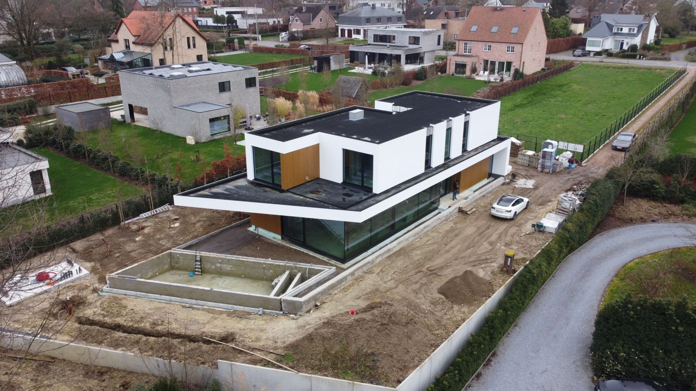

# BOOM
boom project with wannes. sensor implementatie
## includes
1: test blinkercode for 32 wroom with, but power supply is not going tgrough microusb, but through the board.  this is so we can connect the board safely to ther terminal block. in the following example i connect the VCC and GND from a 5v convertedr inbto the VIN pin and ibn tot GND pin of the nmicrocontroller though a breadboard.

2: screw terminal breakoput board for esp32. kiCad diagram and schamatics.
    download symbol from snapeda: https://www.snapeda.com/parts/ESP32-DEVKIT-V1/Do%20it/view-part/?t=esp32%20devkitv1

# Board Schematics
[View Schematics PDF](./media/fuse_box_schematic.pdf)

# design:
design iterations are documented here

	
	
	
	
	
	
	
	
	
	
	
	
	
	
	
	
	
	
	
	
	
	
	
	
	
	
	

# partslist

https://www.automation24.be/nl/

	
	
	

https://www.tinytronics.nl/

	
	

# progressphotos
## visit 1

	
	
	
	
	
	
	
	
	
	
	
	
	
	
	
	
	
	
	
	
	
	
	
	
	
	
	
	
	
	
	
	

### drone footage

	
	
	
	
	
	
	
	

# Communication

  bespreking 1

veel kiezels, knmikkers in basin voor insecten
volgebadplaats wel 2 cm diepte nodig

oppervlakte maakt ni zoveel ui, afwatering naar allerlei andere plaatsten.

toevoegingen:
shaduw: hout, waartplant en egel compiostvat
bomen kunnen naar elkaar toegroeien, verbinding tussen elkaar

-------------------------

voor nu: waterbasin, en bloempot afmaken voor 13e
in patio, 3meter hoogte

van 3.2m tot 4m

  bespreking 2 

wannes:
onderkant te zwaar
meer fragiliteit
chaos particles iets j=hogert gesiuturred
animatie van gesiluleerde vectors

  bespreking 3 

ris, zoals ik al schreef in de groep, bedankt voor het harde werk en het tijdig afleveren van een model aan Yannick. Een fysiek schaalmodel gaat alles voor de klant veel tastbaarder maken en mij helpen in het overtuigen 🙏

Wat betreft een offerte/inschatting voor deel 2 zou ik graag een inschatting hebben voor 3 modellen en een inschatting voor 5 modellen. Graag zou ik dit zondag ontvangen

Wat betreft een korte 'groeivideo' lukt het om dit tegen maandag door te sturen ? 

Wat betreft de 'bloempot'-structuur, dit mag van mij gewoon een variatie met andere seed zijn van het huidige model, het is maar dat ik een variatie kan tonen. Graag tegen zondag (?)

Ik stuur je straks een beeld van een tuinimpressie, als je me dan 3 renders vanuit dit oogpunt ( 1x bloempot, 2x waterbassin vanuit een verschillende hoek) met een neutraal licht (liefst al met mat zwart materiaal) kan sturen  dan kan ik een impressie maken van het geheel.

Verder zie ik dat er heel wat meer werk in het geheel is gekropen, dit komt deels omdat ik je niet vanaf het begin van de volledige informatie wist te voorzien, ik vind het dan ook slechts logisch dat ik je hiervoor vergoed, ik dacht aan €1100, laat maar weten of je hiermee akkoord gaat. 

Merci!

### bespreking wannes_rens
[View PDF](./media/wannes_rens.pdf)

## inspiration:

### hacker manifesto
-[link](https://archive.org/details/pdfy-RtCf3CYEbjKrXgFe/page/n175/mode/2up)

### scematics example
-[link](https://boredomprojects.net/index.php/projects/sensors-for-hems)

### install esp32 block  on bin rail
-[link](https://www.youtube.com/watch?v=UIU_M9MApd0)

-[link](kiCad pcb layout: https://www.youtube.com/watch?v=3FGNw28xBr0)

### make an esp32 breakout block with terminal screws: -[ link](https://www.youtube.com/watch?v=nSP0rKtDYko)

### visual inspiration from pingro craters in svalbard
-[ link](https://www.researchgate.net/figure/The-pingo-and-crater-sites-A-overview-of-the-pingo-site-location-5-in-Fig-1_fig2_329979008)

	
	
	
	
	
	 
	
	

